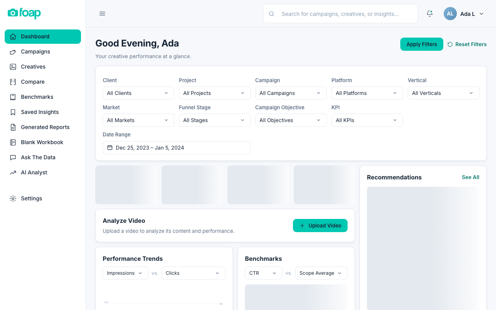

# Creative Intelligence




Creative Intelligence is a local-first tool that turns advertising performance data into creative decisions. Built for Foap, it unifies Meta, TikTok, and spreadsheet exports into one canonical dataset, benchmarks every creative against spend-weighted performance, and runs each asset through a gated AI pipeline — transcribe, frame-sample, vision-annotate, LLM-structure — where confidence is scored and nothing exports until a human verifies it.

## Features

- Upload Meta / TikTok / spreadsheet exports into one canonical dataset
- Transcription, frame sampling, and vision/LLM annotation of creatives (hook types, brand/product/logo seconds, structure, creator-vs-branded)
- Spend-weighted benchmarks, comparisons, and performance trends
- Human-verified gate before one-pager export — nothing ships unverified
- AI Analyst and Ask The Data over the canonical dataset
- Fail-closed provider handling: live calls need keys, otherwise mock/fixture data
- Full pytest suite plus analysis-library self checks

## How Machine-Learning Models Fit Into the System

No model runs standalone here. Models are stages inside the gated pipeline:

- **Transcribe** — audio tracks go to a speech-to-text model, and transcripts carry confidence scores downstream.
- **Frame-sample + vision-annotate** — sampled frames go to a vision model that records hook types, brand/product/logo seconds, and structure.
- **LLM-structure** — transcripts plus vision notes go to a language model that returns structured creative analysis, released only after human verification.

Every call flows through one provider layer (`Backend/creative_intel/providers.py` plus dispatcher) covering OpenAI, Gemini, Anthropic, NVIDIA, and others, so models are swappable without rewriting pipeline logic. Keys resolve environment-first; without them the system fails closed to fixture data and the suite still passes. Note: models are consumed as hosted APIs, not a self-hosted inference server.

## Stack

- Python, FastAPI, SQLAlchemy, Alembic
- React + Vite frontend (same-origin, served by the backend in production)
- SQLite canonical store
- Docker and systemd (Oracle demo deploy)
- Provider integrations: OpenAI, Gemini, Anthropic, NVIDIA, DeepSeek, and more (bring your own keys)

## Quick Start

You need Python 3.13 and `uv` (or pip). No keys required — the app runs on fixture data out of the box.

```bash
python3 -m venv .venv && . .venv/bin/activate
python3 -m pip install --require-hashes -r requirements.lock   # exact CI-tested tree
python3 -m pytest tests/ -q                                    # full suite
python3 Source/self_check.py                                   # analysis-library checks
python3 Backend/ci_backend/main.py --db Data/local.db          # serve on 127.0.0.1:4321
```

Frontend (same-origin React UI, served by the backend in production):

```bash
cd apps/creative-intelligence-ui
pnpm install --frozen-lockfile
pnpm typecheck && pnpm test && pnpm build
```

Open `http://127.0.0.1:4321`. Fixture load + replay:

```bash
python3 Backend/ci_backend/main.py --load-fixture --db Data/local.db
curl -X POST http://127.0.0.1:4321/api/replay/run
```

## Run On A Server

Free Oracle demo deploy: `docs/ORACLE_ALWAYS_FREE.md` (one command:
`sudo DOMAIN=… EMAIL=… bash deploy/oracle/setup-demo.sh`).

Provider keys resolve environment-first
(`CREATIVE_INTEL_KEY_<PROVIDER>`, see `docs/PROVIDERS.md`), falling
back to the OS keychain on developer Macs only. The repo never
contains `.env` files, keys, or tokens; live provider calls fail
closed to mock/fixture data when no key is present.

## Documentation

- `docs/Architecture.md` — system design
- `docs/PROVIDERS.md` — provider setup and keys
- `docs/FRONTEND.md` — UI guide
- `docs/BACKUP.md` — backup and restore
- `docs/ORACLE_ALWAYS_FREE.md` — demo deploy
- `docs/Visual Review.md` — visual review flow
- `Schema/Canonical Schema V0.json` — canonical dataset definition

## Contributing

Issues and pull requests are welcome. For security vulnerabilities, please
report them privately rather than filing a public issue.

## Author

Built by **Simran Dhillon**.
